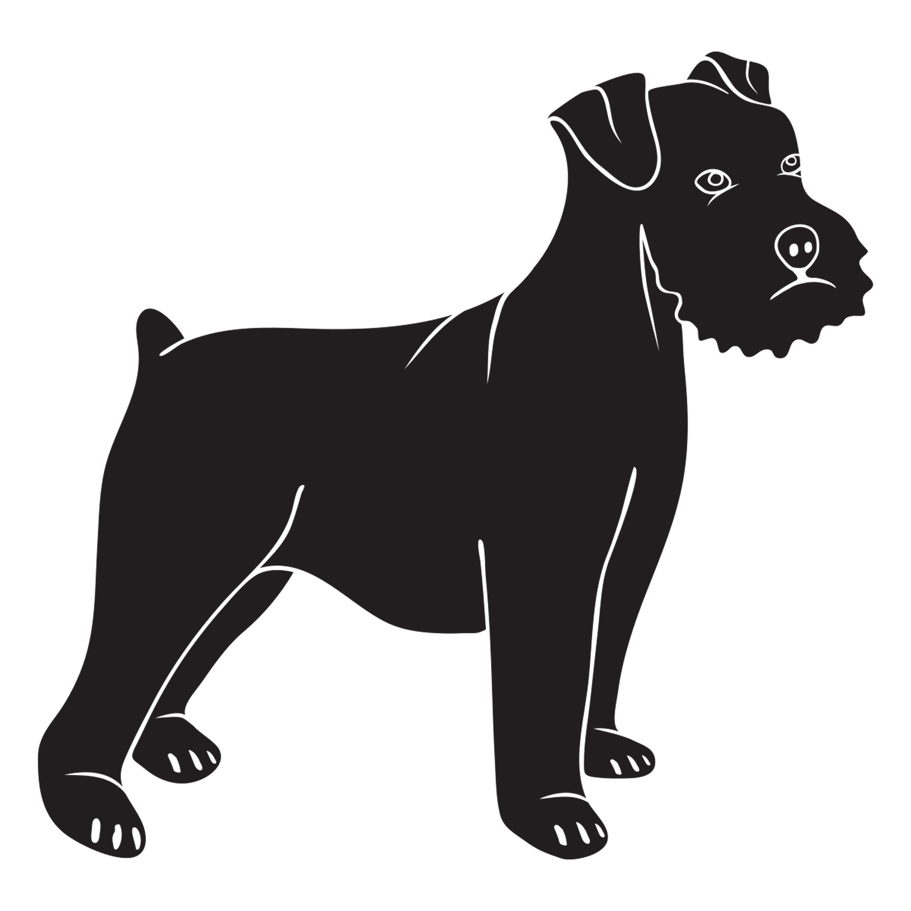
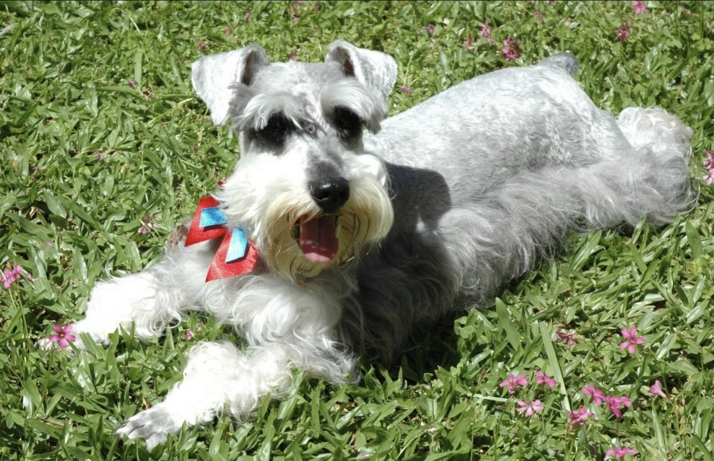

  
  <h1>Capitu</h1>
  
<em>A dark theme built with love — and dedicated to a very good girl.</em>

  
  
  

---

## 🐾 The Story Behind the Name

Capitu was my first dog, a fluffy and grumpy Schnauzer! She joined our family in 2009 and became an angel in 2026. This theme unites my favorite colors and is a way to pay tribute to her. Forever my little partner!

  

**Enjoy!**

> *Forever missed! 🐾*

---

## 🎨 Color Palette

The theme is built around a **near-pitch-black** background that's easy on the eyes, with two signature accent colors:

| Role | Color | Preview |
|------|-------|---------|
| Background | `#070708` |  Deep black |
| Accent Green | `#50fa7b` |  Neon mint |
| Accent Orange | `#ff9f43` |  Warm amber |
| Foreground | `#d4d4d4` |  Soft white |

- 🟢 **Green** highlights active elements, sidebar titles, and file icons
- 🟠 **Orange** draws attention to focus borders and badges
- ⚫ **Deep blacks** keep the environment distraction-free during long coding sessions

---

## 🚀 Installation

1. Open **VS Code**
2. Go to **Extensions** (`Ctrl+Shift+X`)
3. Search for **Capitu**
4. Click **Install**
5. Open the Command Palette (`Ctrl+Shift+P`) → **Preferences: Color Theme** → select **Capitu**

---

## 💛 In Memory of Capitu

*2009 – 2026*

She didn't know what code was. But she was always right there beside me while I wrote it.

This one's for you, girl. 🐾

---

  Made with love by <a href="https://marketplace.visualstudio.com/publishers/p0ntiun">p0ntiun</a>

